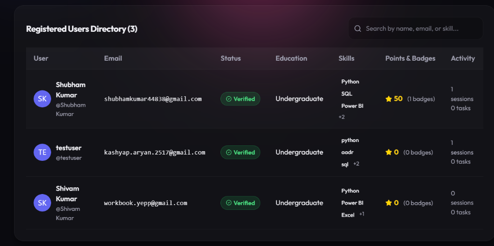
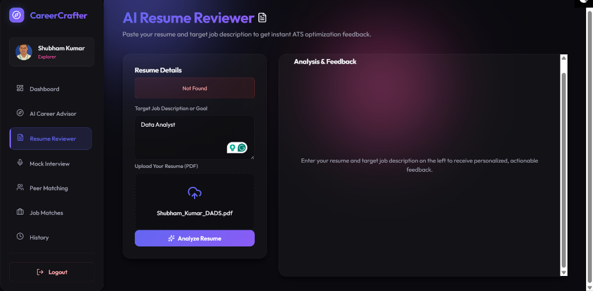
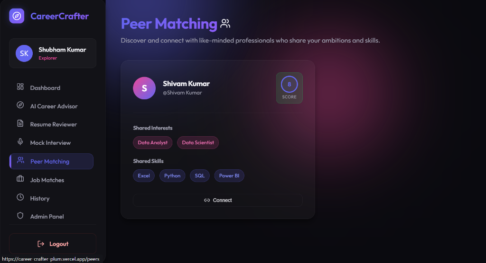
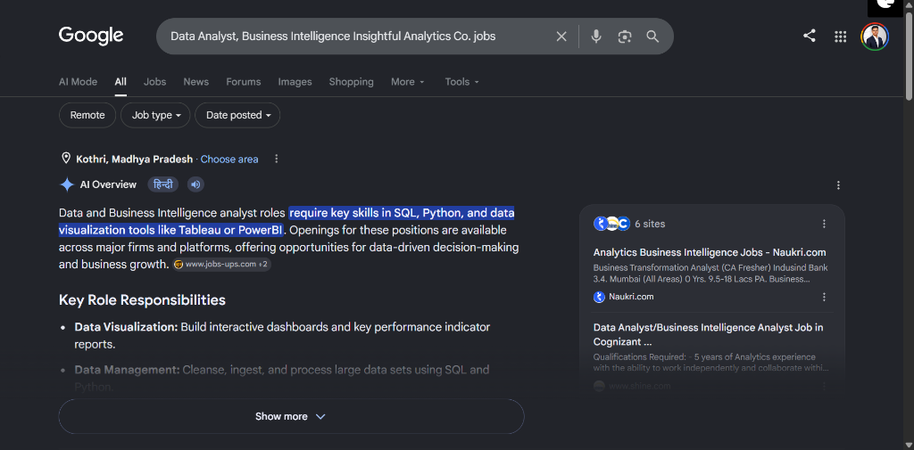

<div align="center">

<pre>
 ██████╗ █████╗ ██████╗ ███████╗███████╗██████╗      
██╔════╝██╔══██╗██╔══██╗██╔════╝██╔════╝██╔══██╗     
██║     ███████║██████╔╝█████╗  █████╗  ██████╔╝     
██║     ██╔══██║██╔══██╗██╔══╝  ██╔══╝  ██╔══██╗     
╚██████╗██║  ██║██║  ██║███████╗███████╗██║  ██║     
 ╚═════╝╚═╝  ╚═╝╚═╝  ╚═╝╚══════╝╚══════╝╚═╝  ╚═╝    
 ██████╗██████╗  █████╗ ███████╗████████╗███████╗██████╗ 
██╔════╝██╔══██╗██╔══██╗██╔════╝╚══██╔══╝██╔════╝██╔══██╗
██║     ██████╔╝███████║█████╗     ██║   █████╗  ██████╔╝
██║     ██╔══██╗██╔══██║██╔══╝     ██║   ██╔══╝  ██╔══██╗
╚██████╗██║  ██║██║  ██║██║        ██║   ███████╗██║  ██║
 ╚═════╝╚═╝  ╚═╝╚═╝  ╚═╝╚═╝        ╚═╝   ╚══════╝╚═╝  ╚═╝
</pre>

### `Full-Stack AI-Powered Career Guidance & Interview Readiness Platform`

[](https://career-crafter-plum.vercel.app)
[](https://careercrafter-1.onrender.com/docs)
[](https://careercrafter-1.onrender.com/admin/schema)
[](https://deepmind.google/technologies/gemini/)
[](./docker-compose.yml)
[](./LICENSE)

<br/>

> *Empowering career growth through intelligent AI pathways, hands-free mock interviews, ATS resume optimization, and peer networking.*  
> **Live Production App:** **[https://career-crafter-plum.vercel.app](https://career-crafter-plum.vercel.app)**

<br/>

---

</div>

<br/>

## 📸 Platform Screenshots

<div align="center">

### 🛡️ Admin Control Panel & Registered Users Directory


<br/>

### 🎙️ Continuous Hands-Free Mock Interviewer with PIP Webcam Mirror & Scorecard


<br/>

### 🤝 Case-Insensitive Peer Matching Engine


<br/>

### 🔑 Secure OTP Authentication & Password Management


</div>

<br/>

---

## ⚡ What is CareerCrafter?

**CareerCrafter** is an enterprise-grade AI career platform that bridges the gap between ambitious students, job seekers, and industry careers. By orchestrating **Google Gemini AI**, **Web Speech Recognition**, **MediaDevices PIP Video Streams**, **PostgreSQL**, and **Brevo/Resend Email Services**, CareerCrafter provides a comprehensive career acceleration hub in a unified glassmorphism interface.

<br/>

## ✨ Core Features

### 🧠 1. AI Career Advisor & Custom Pathways
- Generates personalized structured career roadmaps based on user education, skills, interests, and target roles.
- Returns actionable task checklists and recommended learning resources (Udemy, Coursera, YouTube).

### 📄 2. ATS Resume Reviewer & PDF Parser
- Directly upload PDF or TXT resume files (`/ai/parse-resume`).
- Receives detailed ATS critique, formatting feedback, skill gap analysis, and calculated compatibility scores.
- Save critique history and export polished PDF reports via **HTML2PDF**.

### 🎙️ 3. 100% Continuous Hands-Free Mock Interviewer
- **Continuous Voice Loop**: Uses Web Speech API with auto-pausing synthesis (`utterance.onend`) for natural back-and-forth speech without holding buttons.
- **PIP Webcam Mirror**: Integrated live PIP webcam feed (`<video />`) for body language self-awareness.
- **Interactive Evaluation Scorecard**: Generates 3 key score meters (Technical, Communication, Problem Solving), verdict badge ("Strong Hire", "Hire", "Needs Practice"), top strengths, and improvement points.
- PDF Scorecard Export for sharing with mentors.

### 🤝 4. Case-Insensitive Peer Matching Engine
- Weighted similarity scoring algorithm:
  $$\text{Match Score} = (2 \times \text{Matching Interests}) + (1 \times \text{Matching Skills})$$
- Case-insensitive normalization matching `Python`/`python` and `SQL`/`sql`.
- **1-Click Connect**: Sends styled email introductions connecting peers with LinkedIn and GitHub links.

### 💼 5. Multi-Portal Job Matches
- Filter job roles dynamically by domain or experience level.
- 1-click deep-linking search across **LinkedIn**, **Indeed**, **Naukri**, **Glassdoor**, and **Instahyre**.

### 🏆 6. Gamification & Badges Engine
- Award points and unlock badges:
  - 🎓 **+30 Points**: Generating a new Career Roadmap (`Career Pioneer` badge).
  - 📄 **+50 Points**: Completing an ATS Resume Review (`ATS Master` badge).
  - 🎙️ **+100 Points**: Finishing a Mock Interview session (`Interview Pro` badge).
- Unlocked Badges showcase card rendered on user dashboards.

### 🛡️ 7. Admin Control Panel (`/admin`)
- Accessible only to authorized administrators (`Shubham Kumar` / `admin`).
- Real-time **Registered Users Table** with search/filter capabilities.
- Admin Superpowers:
  - 🗑️ **Delete User Account** (`DELETE /admin/users/{id}`)
  - ⚡ **Toggle Account Verification** (`POST /admin/users/{id}/toggle-verify`)
  - 🏆 **Award Bonus Points** (`POST /admin/users/{id}/award-points`)
- 1-Click **User Data Export to CSV**.

### ✉️ 8. Branded HTML Email System
- High-contrast dark-mode OTP verification email templates.
- Automated **Welcome Email** on successful user registration.
- Styled **Peer Connection Cards**.
- Delivered via **Brevo / Resend HTTPS APIs** (bypassing outbound SMTP port blocks).

### 💾 9. Permanent Cloud PostgreSQL Storage
- Production database hosted on **Render Cloud PostgreSQL** (`careercrafter-db`).
- Guarantees 100% data persistence across server restarts and deployments.

<br/>

## 🛠️ Tech Stack

| Layer | Technologies Used |
|---|---|
| **Frontend UI** | React 18, Vite 8, Vanilla CSS Glassmorphism, Lucide React Icons |
| **Speech & Video** | Web Speech API (Synthesis & Recognition), MediaDevices PIP Webcam Stream |
| **PDF Generation** | HTML2PDF.js |
| **Backend Framework** | Python 3.11, FastAPI, Uvicorn |
| **Database & ORM** | PostgreSQL, SQLite (Dev fallback), SQLAlchemy |
| **AI Infrastructure** | Google Gemini AI (2.5 Flash / Pro Models) |
| **Email Gateway** | Brevo HTTP API, Resend HTTP API, SMTP Fallback |
| **DevOps & Hosting** | Docker, Docker Compose, Vercel (Frontend), Render (Backend & PostgreSQL) |

<br/>

## 📁 Project Structure

```text
CareerCrafter/
├── backend/
│   ├── routers/
│   │   ├── ai.py             # Gemini AI, ATS parser, Mock Interview evaluator
│   │   ├── auth.py           # OTP auth, registration & login endpoints
│   │   ├── peers.py          # Case-insensitive peer matching & connection
│   │   ├── profile.py        # User profile & avatar management
│   │   └── tasks.py          # Action plan tasks tracking
│   ├── database.py           # SQLAlchemy PostgreSQL / SQLite database engine
│   ├── email_service.py      # Brevo / Resend / SMTP email delivery engine
│   ├── email_templates.py    # Dark-mode HTML email template generator
│   ├── main.py               # FastAPI application entry & Admin endpoints
│   ├── models.py             # SQLAlchemy ORM Models
│   ├── schemas.py            # Pydantic Schemas
│   ├── security.py           # Password hashing & JWT Access Tokens
│   ├── Dockerfile            # Backend container setup
│   └── requirements.txt
│
├── frontend/
│   ├── src/
│   │   ├── components/       # Layout, Navigation & Glassmorphism widgets
│   │   ├── context/          # AuthContext & Axios API client
│   │   ├── pages/            # Dashboard, Advisor, ResumeReviewer, MockInterview,
│   │   │                     # PeerMatching, JobBoard, History, AdminPanel
│   │   ├── App.jsx           # App routing & protection wrappers
│   │   └── main.jsx
│   ├── Dockerfile            # Multi-stage Nginx build setup
│   └── vercel.json           # SPA routing config
│
├── screenshots/              # README preview images
├── docker-compose.yml        # 1-Click full stack container orchestration
├── render.yaml               # Render Cloud deployment manifest
└── README.md
```

<br/>

## 🚀 Getting Started

### Prerequisites

- **Node.js 20+** & **Python 3.11+**
- A free **Google Gemini API Key** from [Google AI Studio](https://aistudio.google.com/)

---

### Local Development Setup

**1. Clone the repository**
```bash
git clone https://github.com/Shub-ways/CareerCrafter.git
cd CareerCrafter
```

**2. Setup Backend**
```bash
# Create virtual environment
python -m venv venv
venv\Scripts\activate       # Windows
source venv/bin/activate    # Linux/Mac

# Install dependencies
pip install -r backend/requirements.txt

# Create .env file in backend/
cp .env.example backend/.env
```

Add your environment variables to `backend/.env`:
```env
GEMINI_API_KEY=your_gemini_api_key
SMTP_HOST=smtp.gmail.com
SMTP_PORT=587
SMTP_USER=careercrafter.app@gmail.com
SMTP_PASS=your_app_password
```

Run backend server:
```bash
cd backend
uvicorn main:app --reload --port 8000
```

**3. Setup Frontend**
```bash
cd frontend
npm install
npm run dev
```

App will run at **`http://localhost:5173`** 🎉

<br/>

---

## 🐳 1-Click Docker Deployment

Run the complete stack (FastAPI + Nginx React + SQLite) with one command:

```bash
docker-compose up --build -d
```

Access:
- **Frontend App**: `http://localhost:3000`
- **Backend API**: `http://localhost:8000`

<br/>

---

## 🌐 Live Production Deployment Links

| Service | Live Production URL |
|---|---|
| **Live Web App** | 🔗 **[https://career-crafter-plum.vercel.app](https://career-crafter-plum.vercel.app)** |
| **Backend API Server** | ⚡ **[https://careercrafter-1.onrender.com](https://careercrafter-1.onrender.com)** |
| **Interactive API Docs** | 📖 **[https://careercrafter-1.onrender.com/docs](https://careercrafter-1.onrender.com/docs)** |
| **Database Schema Inspector**| 🗄️ **[https://careercrafter-1.onrender.com/admin/schema](https://careercrafter-1.onrender.com/admin/schema)** |

<br/>

---

## 📄 License

Distributed under the **MIT License**. See [`LICENSE`](./LICENSE) for more information.

<br/>

## 👨‍💻 Author

<div align="center">

**Shubham Kumar**

[](https://github.com/Shub-ways)
[](https://www.linkedin.com/in/kashyap-aryan/)

*Built with ❤️ as a Gen AI Career Acceleration Project*

---

⭐ **If CareerCrafter helped you, consider giving it a star on GitHub!** ⭐

</div>
